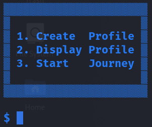
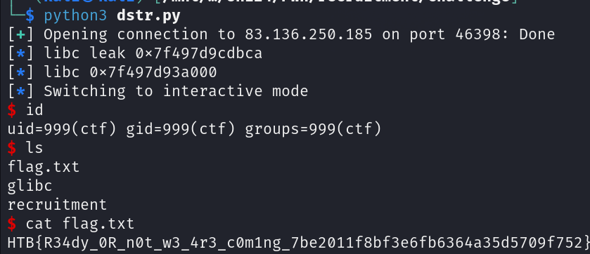

Difficulty: `easy`

In this long and arduous quest to retrieve The Starry Spurr, we seek only the most loyal and courageous young souls. If you have the strength and determination, come forth and join us on this epic journey!

## Init

We are given a docker environment, binary and custom glibc.

The binary security:
```
    Arch:       amd64-64-little
    RELRO:      Full RELRO
    Stack:      No canary found
    NX:         NX enabled
    PIE:        No PIE (0x400000)
    RUNPATH:    b'./glibc/'
    SHSTK:      Enabled
    IBT:        Enabled
    Stripped:   No
```

No `canary` and `PIE` is huge.

## Reversing

We have a C++ binary which has a menu with 3 options:


### Creating profile

For profile creation we have several variables:
- name
- class
- age

These are allocated on the heap (pointers).

The inputting process is as such:
```c
  std::operator<<((ostream *)std::cout,
                  "\n[*] You need to enter your Name, Class, and Age.\n\n[+] Name:  ");
  std::getline<>((istream *)std::cin,local_48);
  std::operator<<((ostream *)std::cout,"[+] Class: ");
  std::getline<>((istream *)std::cin,local_68);
  std::operator<<((ostream *)std::cout,"[+] Age:   ");
  read(0,local_168,0x20);
```

As for `age` we shall be using `read` instead of classic C++ `cin`.

**We shall be writing into stack first and then it's copied.**

These variables are then printed as strings back to us.

### Start Journey

This essentially only tells a piece of story and then proceeds to use `getline()` into a stack variable.

```c
std::istream::getline(std::cin,(long)&local_28,0x2f);
```

*Depending on your tooling this may be different. Ghidra is not capable of recognizing the last argument - 0x2f. Must be done manually.*

## Vulnerability Research

No need for fuzzing or anything, these bugs are simple enough for manual research.

### Stack OOBW

In the `journey` code path we can see that the `getline` is expecting `0x2f` bytes.

Well this is strongly overflowable as we are not using `std::string`, but classic pointer instead into a statically allocated stack buffer.

### Unitialized Variable Leakage

The buffers which are written into during create profile code path are not actually initialized.

This in itself might've been useless, however with the `read` API call into `age` variable we can leak anything which was written on the stack before.

Such leakage can be used to bypass ASLR for libraries or binary (We do not have PIE in this challenge however).

## Exploit Development

This is a pretty classic stack overflow challenge. There is one catch however (And one more for the remote version).

### Finding RIP

The distance to `ret` can be fuzzed or calculated. For better writeup exp:
```
pwndbg> dq $rsp-0x40
00007ffdca910490     0000000000000a33 00007ffdca910700
00007ffdca9104a0     4141414141414141 4141414141414141
00007ffdca9104b0     4141414141414141 4141414141414141
00007ffdca9104c0     4141414141414141 0000414141414141

*RIP  0x414141414141

```

We are only capable of overwritting 6 bytes from `ret` address.

There is the catch.. it means we can only use a single ROP gadget to achieve something.

As bad as it sounds inside Linux glibc we have several gadgets which take care of executing `/bin/sh` for us without much work. Such gadget was given nickname: `one gadget`. You can utilize several tools to find it, however I mostly use [this one](https://github.com/david942j/one_gadget).
These gadgets have certain constraints in which the registers must be setup, otherwise we fail. This can be easily done manually by trial and error as you only have a few of them available.

### Libc info leak

Libraries are still affected by ASLR, therefore we are required to leak it.

Fortunately for us several addresses are present at the stack position which we are overwriting:
```
00007ffd3a737390     00007f8b5ae045c0 00007f8b5ae01ee0
00007ffd3a7373a0     0000000000000110 0000000000404220
00007ffd3a7373b0     00007ffd3a737400 00007f8b5ac93bca
```

We can see 3 library addresses - they start off with 0x7f8b...
These are the main points of interest.

**Now here is the catch number 2!**

The remote version has different context for some reason (docker was also different for me during solving).
Which meant the addresses were missing from these offsets and it required a little *guessing time*.

Eventually I found out that the libc address which we can see at the + 0x28 is at 0x18 on remote.
And thus I used offsets from `00007f8b5ac93bca`.

### Popping the shell

Overall the main flow goes like this:
1. Leak libc address during profile creation
2. Start journey to overflow
3. Use one gadget with right constraints to pop shell




## Attachment

- [Solver script](dstr.py)
- [Challenge files](pwn_recruitment.zip)
